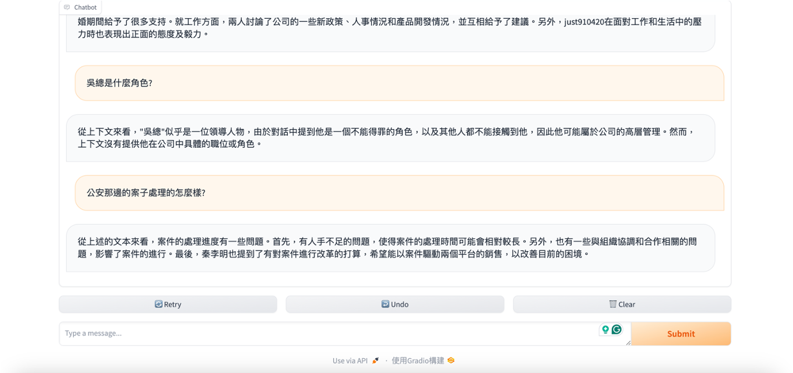
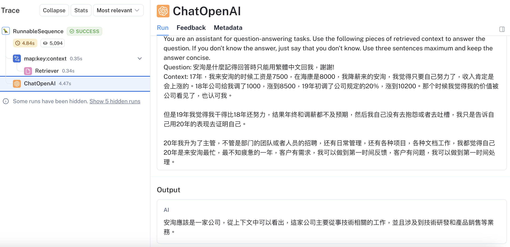

# Original leak
https://github.com/I-S00N/I-S00N

# Anxun-isoon
The iSoon/Anxun leak in a single json file (cn_extracted_messages.json) from https://github.com/soufianetahiri/Anxun-isoon

# Dataset

It is said that projects that share leaked information will be deleted.

So I won’t share it here. If you want RAG to work, the actual method is to read all the md files and turn them into a DocumentPage and save them into Vector.

Files: 188,756,641 byte, Total 579 items

# RAG

RAG is a technique for augmenting LLM knowledge with additional data.

LLMs can reason about wide-ranging topics, but their knowledge is limited to the public data up to a specific point in time that they were trained on. If you want to build AI applications that can reason about private data or data introduced after a model’s cutoff date, you need to augment the knowledge of the model with the specific information it needs. The process of bringing the appropriate information and inserting it into the model prompt is known as Retrieval Augmented Generation (RAG).

From https://python.langchain.com/docs/use_cases/question_answering/

# Gradio

Gradio is the fastest way to demo your machine learning model with a friendly web interface so that anyone can use it, anywhere!

From https://www.gradio.app/

# How to use

Enviroment: CentOS 7
```
pip3 install -r requirements.txt
```
set env value
```
os.environ["LANGCHAIN_API_KEY"] = ""
os.environ["OPENAI_API_KEY"] = ""  # Replace with your key
```
then
```
python3 rag.py
```
or you want to add ssl, just modify ...

```
gr.ChatInterface(predict).launch(server_name="0.0.0.0",ssl_certfile="cert.pem",sslkeyfile="key.pem",ssl_verify=False)
```

# Demo

## Gradio Support


## Langsmith track

